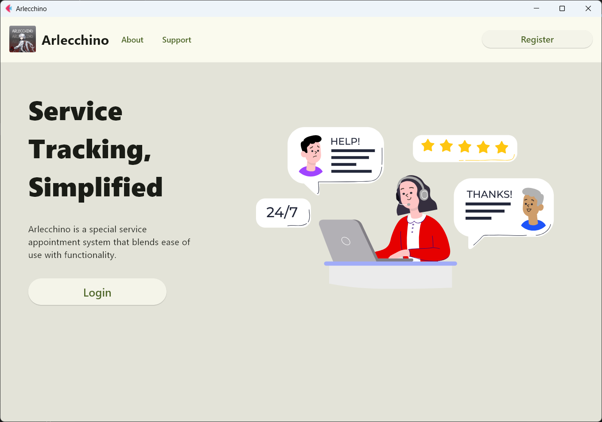

<div>
    <h1 align="center">Screwllum</h1>
    <h3 align="center">Service Tracking, Simplified</h3>
</div>



<br>
Screwllum is a special service appointment system that blends ease of use with functionality, written in Flet and Python

## Try
Install the following dependencies using pip
```
pip install flet flet_route firebase_admin pillow google-auth opencv-python 
```
Clone repository and change directory
```
git clone https://github.com/treppenwitz03/screwllum.git
cd screwllum
```

Start Morax on your system
```
python main.py
```

## Discussions
If you want to ask any questions or provide feedback, you can make issues in this repository

## Contributing
Feel free to send pull requests to this repository with your code.


<br>
<sup><b>License</b>: GNU GPLv3</sup>

## Developed by:
### Malicsi, Owen David P.
## based on https://github.com/neverbdneverw/morax
